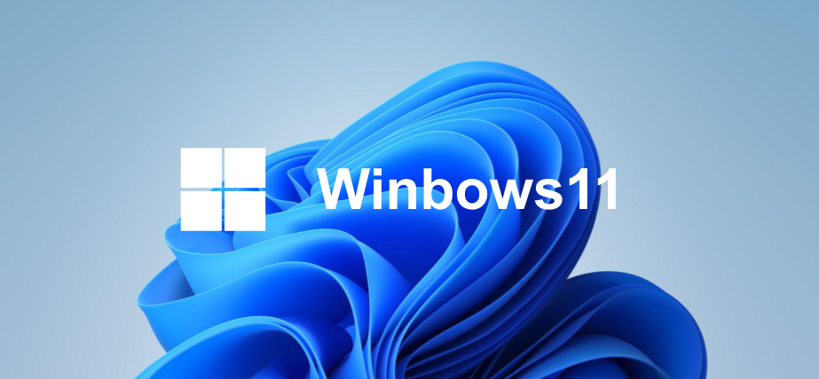

  
  

# Winbows11

Just like Windows11, **Winbows11** lets you experience Windows11 UI and animations on your web browser!

## Notice

> [!IMPORTANT]
> This project is **not in anyway affiliated with Microsoft** and **should not be confused with Microsoft’s Operating System** or Products.  
> This is **not** a Windows 365 cloud PC, this is **Winbows11**.

## Now under development

Windows11 is currently in development, so some features are not available yet, but don’t worry, they will be there soon!

# Star this Repo

If you find this repository useful or interesting, please give it a star! It helps a lot and is greatly appreciated. Thanks for your support! 😘

## Features

- [x] Window animation
- [x] Command App
- [x] Taskbar
- [x] Start Menu
- [x] File Explorer
- [x] Drag and Resize windows
- [x] Lock screen
- [x] Maximize, minimize, full screen window
- [x] Microhard Edge
- [x] Right click menu
- [x] Image Viewer
- [x] JSON Viewer
- [x] Contextmenu
- [x] Snap windows
- [x] Font and background customization
- [x] Process desktop items in batches
- [x] Settings
- [x] Task View
- [ ] Upload file to desktop
- [ ] Search Menu
- [ ] Microhard Store
- [ ] Media player
- [ ] i18n
