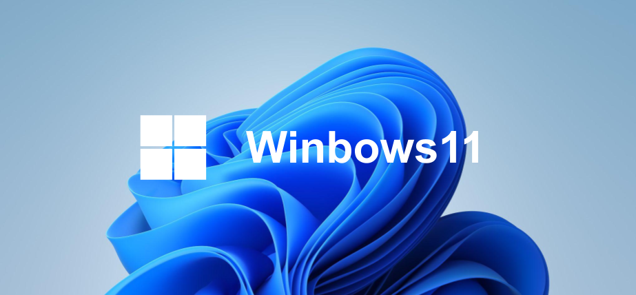
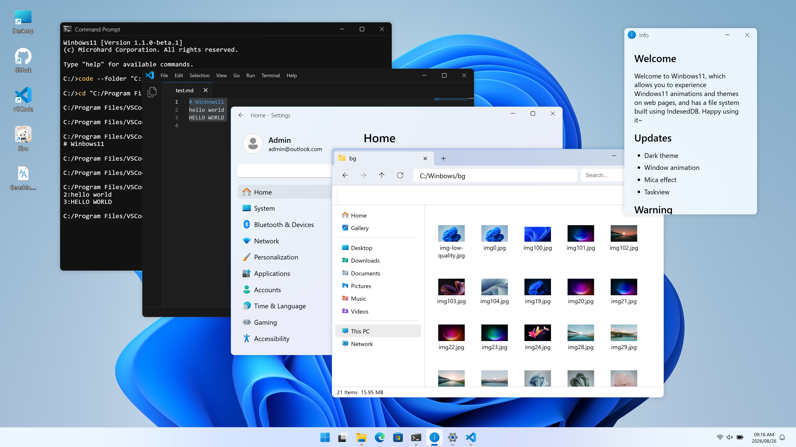
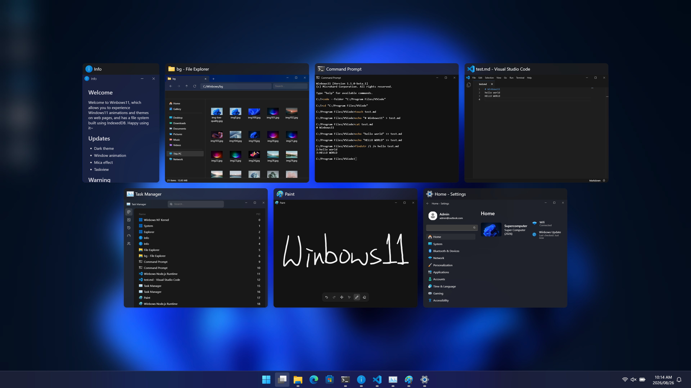
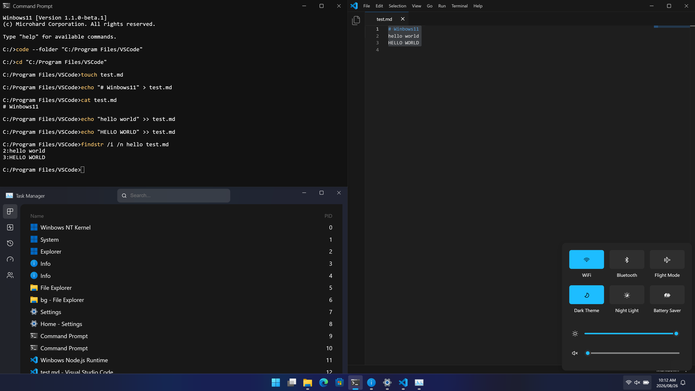
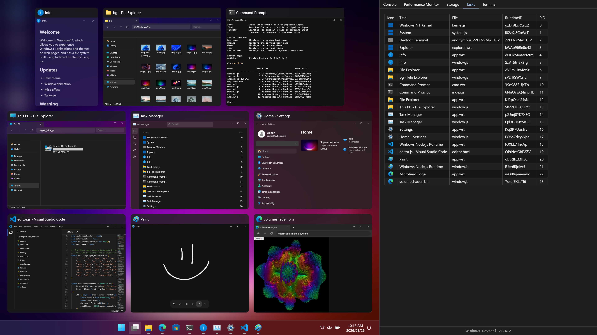

<div align="center">



# Winbows11

让你在浏览器里运行应用程序、管理文件、使用终端，并体验流畅的窗口动画与界面过渡。

<br>

[](./LICENSE)
[](https://github.com/Siyu1017/winbows11/stargazers)
[](https://github.com/Siyu1017/winbows11/forks)
[](https://github.com/Siyu1017/winbows11/issues)
[](https://winbows11.vercel.app)
[](https://winbows11-beta.vercel.app)

[English](./README.md) | [繁體中文](./README.zh-TW.md) | 简体中文

</div>

## 试试 Winbows11

Winbows11 可以直接在浏览器中运行，无需安装即可使用。

| 版本 | 分支 | 说明 | 网站 |
| :---: | :-: | --- | --- |
| **Stable** | `main` | 当前稳定版本 | [winbows11.vercel.app](https://winbows11.vercel.app) |
| **Beta** | `beta` | 包含最新功能与架构变更的版本 | [winbows11-beta.vercel.app](https://winbows11-beta.vercel.app) |

## 关于 Winbows11

这个项目由 [WebOS](https://github.com/Siyu1017/WebOS) 演变而来。最初我受到 [Win11 in React](https://win11.blueedge.me/) 的启发，决定自己编写一个网页版 Win11，并将其命名为 WebOS。后来又在原有桌面模拟的基础上逐步加入自己的 runtime、文件系统、进程管理、Shell、窗口管理和其他系统功能，一路发展成了现在的 Winbows11。

目前 Winbows11 主要包含：

- Winbows Runtime（WRT）应用程序运行环境
- 以 IndexedDB 为主要持久化后端的虚拟文件系统
- 进程、信号、子进程与 stdio 模型
- 基于命名管道概念的 IPC
- Shell 与终端
- `WApplication` / `BrowserWindow` 应用程序与窗口框架
- 任务栏、开始菜单、Task View
- 文件资源管理器、设置及其他已完成的内置应用程序
- Developer Tools、SDK 与系统 API
- HMGR 硬件抽象层，目前主要提供网络适配器模拟

> [!IMPORTANT]
> Winbows11 是独立开发的项目，与 Microsoft 不存在任何隶属、授权或合作关系。<br>
> 请勿将其与 Microsoft Windows、Windows 365 或其他 Microsoft 产品混淆。

## 界面展示

### 桌面与应用程序

桌面可以同时打开多个应用程序窗口并使用桌面快捷方式，也可以将设备上的文件或文件夹拖放到桌面，在 Winbows11 中使用。



### Task View

Task View 会显示当前打开的窗口，让用户能够快速查看并切换正在运行的应用程序。



### Snap 与多任务

窗口可以 Snap 到桌面的不同区域，让多个应用程序同时保持可见并一起操作。



### Developer Tools

Developer Tools 内置任务列表、控制台、性能监视器、终端和存储空间面板，可以直接查看当前运行中的进程、性能和文件系统信息，也可以通过控制台和终端与 Winbows11 环境交互。



## 功能

### 桌面环境

- 窗口拖动与缩放
- 最小化、最大化、全屏与窗口 Snap
- 可重新排列应用程序图标的任务栏
- 开始菜单
- Task View
- 桌面快捷方式
- 锁屏
- 右键菜单
- 自定义主题与壁纸
- Mica 风格视觉效果

### 内置应用程序

Winbows11 内置多个应用程序，以下为目前已完成的应用程序：

- 文件资源管理器
- Microhard Edge
- VSCode
- Command Prompt
- 画图
- Info
- 任务管理器
- FPS Meter
- 照片
- Network Listener
- JSON 查看器
- 记事本
- 设置
- Node.js

### Developer Tools

Developer Tools 目前包含：

- 任务列表，可查看 Runtime ID、PID 等进程信息
- 控制台
- 性能监视器，可查看 FPS 与 JavaScript heap 使用情况
- 终端
- 存储空间面板，支持文件夹树状浏览，并可查看文件大小与最后修改时间

## Winbows Runtime

**WRT（Winbows Runtime）** 是 Winbows11 的应用程序运行环境，为浏览器中的应用程序提供部分 Node.js-like APIs。部分设计概念受到 [Windows 96](https://windows96.net/) 启发，但 WRT 本身是 Winbows11 项目中的独立实现，并不代表与 Windows 96 共享源代码、具有衍生关系或保证 API 兼容性。

目前 WRT 包含：

- 进程 ID 与父进程 ID
- 进程生命周期与状态管理
- 进程信号
- 环境变量
- 进程参数
- `stdin`、`stdout` 与 `stderr`
- TTY 流
- 子进程
- `spawn()`、`exec()`、`execFile()` 与 `fork()`
- 模块加载与缓存
- 系统 API
- 通过 `WApplication` 创建 GUI 应用程序
- 与 Winbows11 IPC、Shell、VFS 及窗口系统集成

## 文件系统

Winbows11 使用可持久化存储在浏览器中的虚拟文件系统，目前支持：

- 支持卷的文件系统模型
- 独立的 `C:` 系统卷
- 以 IndexedDB 为主要持久化存储后端
- 类似 Node.js 的文件系统 API
- 类似 Node.js 的路径处理工具
- 文件与文件夹操作
- 文件系统事件
- 旧版文件系统数据迁移

> [!IMPORTANT]
> 在某些情况下 IndexedDB 无法使用时，Winbows11 会尝试使用内存作为存储载体，将使用中的文件临时存储在内存中，这些文件会在页面刷新或关闭后丢失

## Shell 与终端

Command Prompt 与 WRT 进程都使用 Winbows11 的 Shell，目前支持：

- 内置命令（可在 Command Prompt 中输入 `help` 命令查看）
- WRT 程序
- 使用 `|` 的命令管道
- 使用 `>` 与 `>>` 的输出重定向
- 使用 `%NAME%` 的环境变量展开
- 文件与文件夹相关命令
- 文本处理命令

例如：

```text
dir | find ".js" > files.txt
```

## 应用程序框架

GUI 应用程序可以通过 `WApplication` 和 `BrowserWindow` 创建及管理窗口，目前可以使用：

- 主窗口
- 子窗口
- 弹出窗口
- 窗口生命周期事件
- 窗口颜色主题
- WRT 脚本加载
- 可访问应用程序窗口中的 DOM
- 使用 `BrowserWindow.loadFile()` 直接加载本地 HTML
- 应用程序注册
- 扩展名关联（目前仅限内置应用程序）

## 浏览器支持

Winbows11 主要在 Google Chrome 和 Microsoft Edge 等基于 Chromium 的浏览器上开发与测试，而 Safari 目前只做过部分兼容性修复，例如处理隐私浏览模式下 IndexedDB 无法使用的情况，还没有经过完整测试，因此其他浏览器虽然可能也能正常使用，目前仍不保证兼容性。

## TODO

Winbows11 仍在持续开发中，目前主要规划包括：

### 应用程序

- [ ] 计算器
- [ ] Microhard Store
- [ ] 媒体播放器
- [ ] 完成更多设置页面与设置功能

### 系统

- [ ] 完善应用程序安装、更新与卸载机制
- [ ] 扩展卷支持
- [ ] 改善文件系统监视与事件行为
- [ ] 扩展文件类型与默认应用程序关联
- [ ] 扩展 HMGR，加入 NIC 以外的虚拟硬件接口
- [ ] 扩展系统 API 与 Shell 内置命令

### 桌面与窗口

- [ ] 加入开始菜单搜索功能
- [ ] 加入应用程序列表
- [ ] 加入小组件（Widgets）
- [ ] 扩展个性化功能
- [ ] 改善多窗口与模态／弹出窗口行为

### 开发体验

- [ ] 扩展 WRT SDK 与示例
- [ ] 完善 WRT TypeScript 类型声明
- [ ] 提供更完整的应用程序开发文档
- [ ] 改善 Developer Tools 性能

### 兼容性与本地化

- [ ] 提升 Safari 与其他非 Chromium 浏览器的兼容性
- [ ] 扩展更多语言
- [ ] 改善不同屏幕尺寸与移动设备上的使用体验

> TODO 内容不代表固定的开发顺序，实际实现项目与优先级可能会随着 Winbows11 的架构调整而变化。

## 开发

安装项目依赖：

```bash
npm install
```

创建开发版本：

```bash
npm run build:dev
```

启动开发服务器：

```bash
npm run start:dev
```

监视源代码变更并自动重新构建：

```bash
npm run build:watch
```

运行 TypeScript 检查：

```bash
npm run type-check
```

创建正式版本：

```bash
npm run build
```

生成的网站与 Winbows11 系统文件会输出到 `public/`。

## 项目结构

```text
winbows11
├─ src/
│  ├─ os/                 核心运行环境与 runtime
│  ├─ pages/              网站与安装页面
│  └─ shared/             共享模块与工具
│
├─ types/
│  └─ wrt/                WRT TypeScript 类型声明
│
├─ scripts/
│  └─ build.js            构建流程
│
├─ public/
│  ├─ assets/
│  │  ├─ images/          静态图片与截图
│  │  ├─ scripts/         生成的 JavaScript
│  │  └─ styles/          生成的样式表
│  ├─ Program Files/      应用程序
│  ├─ Winbows/            系统文件与内置应用程序
│  └─ User/               默认用户文件系统
│
├─ server.js
├─ tsconfig.json
└─ webpack.config.js      Webpack 构建配置
```

## 参与开发

欢迎提交错误报告、建议或代码贡献，报告问题时请附上足以复现问题的信息，并说明预期行为与实际行为。

## 变更记录

版本历史与主要变更请参阅 [CHANGELOG.md](./CHANGELOG.md)。

## 许可证

许可信息请参阅 [LICENSE](./LICENSE)。
